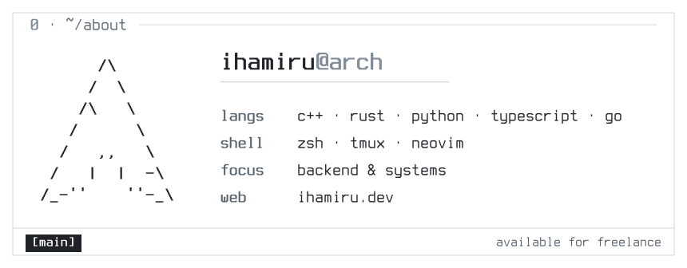

<picture>
  <source media="(prefers-color-scheme: dark)" srcset="banner-dark.svg">
  
</picture>

i'm ihamiru. backend and systems, mostly c++, rust, and go. i like building things that sit close to the hardware: overlays, small engines, tools that poke at the OS directly. GifEngine, a transparent gif overlay for windows, is the one that's public.

most of what i make is private or client work, so github doesn't show much. [ihamiru.dev](https://ihamiru.dev) does: what i've coded this week, what's playing right now, and the numbers behind it. if you live in a terminal, `curl ihamiru.dev` works too.

freelance: contact@ihamiru.dev
